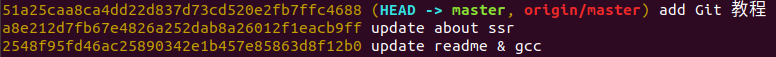
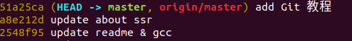

## Git教程

-----

### 1.　本地库初始化

* 命令：``git init``

* 效果：在当前目录，创建一个.git文件夹

### 2. 设置签名

* 项目级别/仓库级别
  * ``git config user.name yourname``
  * ``git config user.email youremail``
  * 保存位置：./.git/config
* 系统用户级别
  * ``git config --global user.name yourname``
  * ``git config --global user.email youremail``
  * 保存位置：~/.gitconfig
* 级别优先级：
  * 项目级别/仓库级别　>  系统用户级别

### 3. 基本操作

#### 3.1 查看状态

* 命令：``git status``

* 功能：``查看工作区、暂存区状态``

* 常见结果：

打印内容 | 含义 |
-|-|
 on branch master | 位于分支master(主分支)|
 no commits yet | 本地库没有任何的已提交的文件 |
 nothing to commit | 暂存区没有可提交的文件 |
 Untracked filed | 未追踪的文件 (未添加到暂存区的文件)|
 nothing added to commit but untracked files present | 暂存区没有文件，但工作区有文件 |
 Changes to be committed | 待提交的改变(暂存区中的文件)|

#### 3.2 添加
* 命令：``git add ``
* 功能：将工作区的"新建/修改添加到暂存区"

#### 3.3 删除
* 命令：``git rm --cached <file>``
* 功能：从暂存区中删除file文件

#### 3.4 提交
##### 3.4.1 提交后输入提交信息
* 命令：``git commit <file>``
* 功能：提交暂存区中的file文件
* 输入次命令后，会进入一个新的窗口，输入本次提交的相关备注

* 输入相关信息后，保存退出即可

##### 3.4.2 提交时输入提交信息
* 命令：``git commit -m "commit-message" <filename>``

#### 3.5 查看历史记录
* 命令：``git log``
  * 效果：

    

  * 多屏显示控制方式
    * 空格：向下翻页
    * b：向上翻页
    * q：退出

* 命令：``git log --pretty=oneline``
  * 效果：

    

* 命令：``git log --oneline``
  * 效果：

    

* 命令：``git reflog``
  * 效果：

    

* 注：
  * (HEAD -> master)代表该版本为当前版本，HEAD是个指针，指向当前版本
  * HEAD@{移动到当前版本需要的步数}
