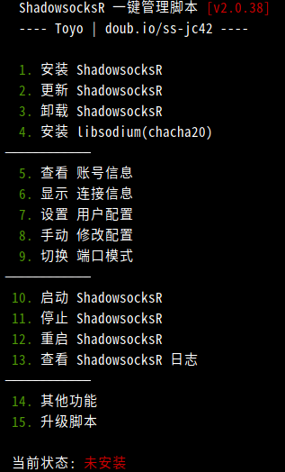
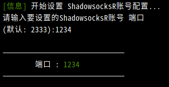
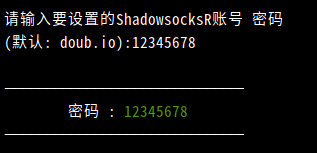
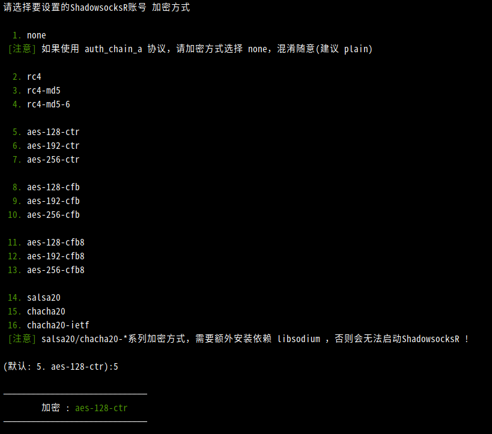
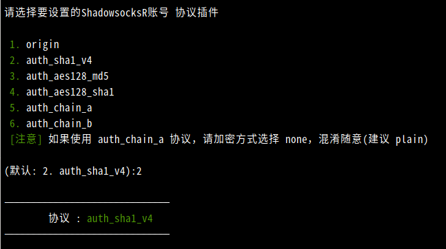
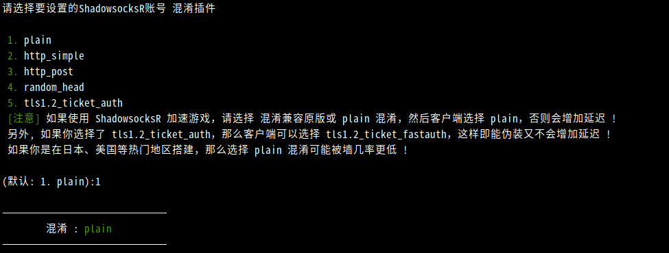

## Ubuntu搭建SSR代理服务器

-----

### 1. 安装SSR代理软件

```
wget -N --no-check-certificate https://raw.githubusercontent.com/ToyoDAdoubi/doubi/master/ssr.sh && chmod +x ssr.sh && bash ssr.sh
```

  

### 2. 选择安装SSR

>输入1，安装SSR

  

-----

### 2. 设置代理的端口号

>输入要用于代理的端口

  

-----

### 3. 设置代理的密码

>输入代理的密码

  

-----

### 4. 设置加密方式

>设置加密方式

  

-----

### 5. 设置协议

>输入代理的协议



-----

### 6. 设置协议的兼容性

>输入"y",表示兼容


-----

### 7. 设置混淆方式

>输入混淆的方式



-----

### 8. 设置同时可连接的设备数

>设置设备数


-----

### 9. 设置单端口的速度上限

>设置单端口的速度上限(默认是无上限)


-----

### 10. 设置总速度的上限

>设置总速度的上限


-----

### 代理服务器搭建完成

-----

### 参考文档

[Ubuntu16.04搭建SSR服务器+锐速](https://www.lstazl.com/ubuntu16-04%E6%90%AD%E5%BB%BAssr%E6%9C%8D%E5%8A%A1%E5%99%A8%E9%94%90%E9%80%9F/)

-----
