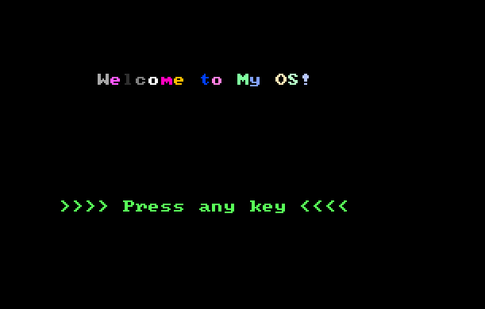
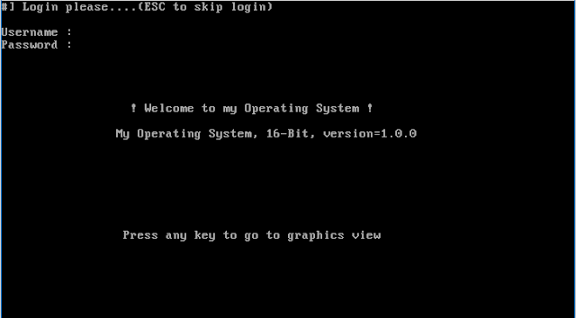
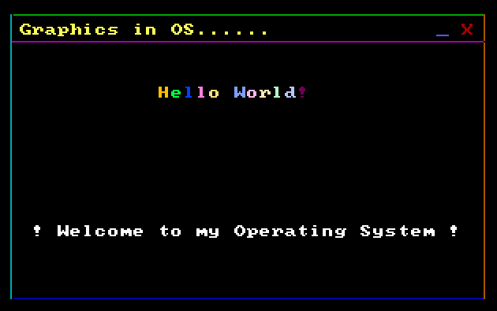

## 搭建自己的操作系统

-----

在本文中，我们将使用16位汇编语言编写自己的引导程序，以创建自己的操作系统

-----

### 0x00 成果展示

-----

### 0x01 简介

编写操作系统是编程领域中最复杂的任务

操作系统的第一部分是Bootloader.Bootloader是在任何操作系统运行之前运行的程序，通常用于引导其他操作系统。 每个操作系统都有一组专用于其的引导程序。引导程序通常包含几种引导OS内核的方法，还包含用于调试和/或修改内核环境的命令。我们将创建3个阶段的OS。 首先是在屏幕上用彩色显示消息，其次是从用户那里输入信息，然后是第三位进行绘图。引导程序通常以16位汇编（也称为实模式）编写，然后可以扩展为32位 -bit（保护模式）。因此，引导加载程序必须以16位汇编语言编写。在转到下一个之前，您必须对16位汇编语言有所了解。
